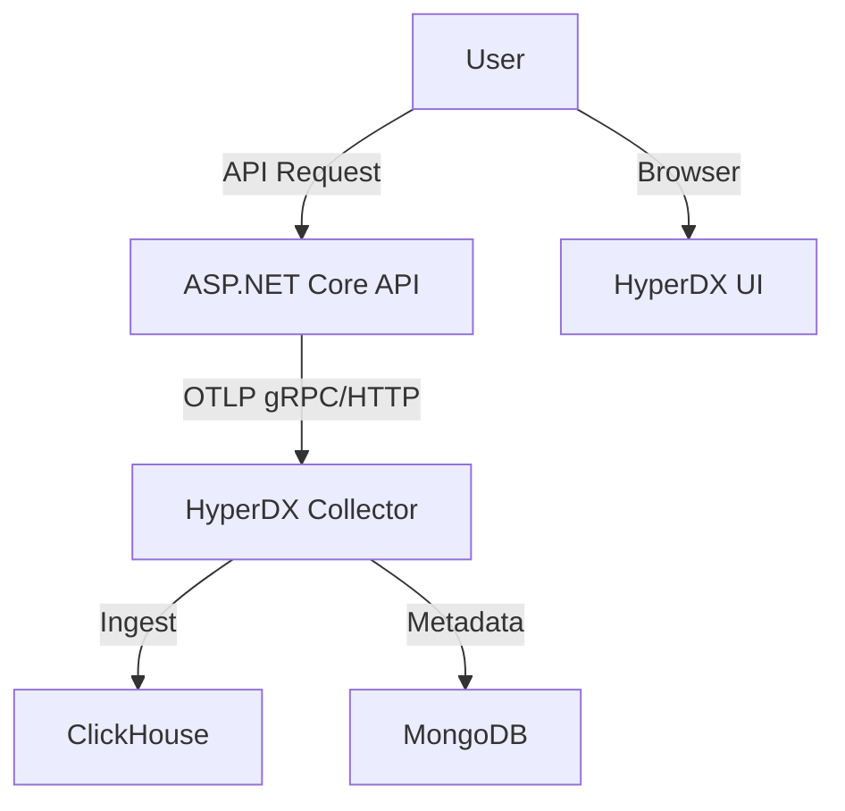

# Implementation Plan - ClickStack ASP.NET Demo

## 1. Project Context
- **Goal**: Create a demo project showcasing full observability (APM, Metrics, Traces, Logs) using the "ClickStack" (ClickHouse + HyperDX + OpenTelemetry).
- **Stack**: .NET Core (Backend), Docker (Infrastructure).
- **Observability**: OpenTelemetry (Data Collection), HyperDX (Backend/UI), ClickHouse (Data Store).

## 2. Architecture

## 3. Technology Selection
- **Framework**: .NET 9 (Latest Stable)
- **Instrumentation**: `OpenTelemetry.Exporter.OpenTelemetryProtocol`
- **Infrastructure**: Docker Compose (hosting HyperDX + ClickHouse)
- **Logging**: `ILogger` integrated with OTel.
- **Traces**: HTTP In/Out, MassTransit (optional), EF Core (optional).
- **Metrics**: Runtime, ASP.NET Core, HttpClient.

## 4. Implementation Steps

### Phase 1: Infrastructure (Docker)
- Create `docker-compose.yml` for self-hosted HyperDX.
- **Note**: HyperDX self-hosted stack includes:
  - `hyperdx-api`
  - `hyperdx-ingestor`
  - `clickhouse-server`
  - `mongodb` (configuration)
  - `minio` (logs/storage)
- *Risk*: This is resource, intensive. Ensure Docker settings allow > 4GB RAM.

### Phase 2: .NET Application Setup
- Create `ClickStack.Api` (Web API).
- Install OTel NuGet packages.
- Implement efficient "Service Collection" extension `AddClickStackConnect()` for clean code.

### Phase 3: Telemetry Configuration
- **Tracing**: Capture incoming requests, HTTP client calls, and manual Activities.
- **Metrics**: Default runtime metrics + custom "Business Metrics" (e.g., `order_processed_count`).
- **Logs**: Structured logging exported via OTLP to HyperDX (correlating with Traces).

### Phase 4: Load Generation
- Simple background service or utility to generate traffic (`/api/gen-traffic`).
- Simulate errors and latency for APM showcase.

## 5. Verification Plan
- **Verify Logs**: Check correlation ID in HyperDX Logs view.
- **Verify Traces**: Ensure full waterfall view of API -> Database/External Service.
- **Verify Metrics**: Dashboard showing RPM (Requests Per Minute) and Latency p95.

---

## 6. Task Breakdown
- [ ] **Task 1**: Setup `docker-compose.yml` with HyperDX stack.
- [ ] **Task 2**: Initialize `.NET Web API` project and solution.
- [ ] **Task 3**: Implement `OpenTelemetry` wiring (Traces, Metrics, Logs).
- [ ] **Task 4**: Create `TrafficGenerator` service for demo data.
- [ ] **Task 5**: Documentation & Verification.
